# aws-lambda-apigw-sample

Deploy APIs for Amazon API Gateway + AWS Lambda (TypeScript) in a variety of ways.

- [AWS SAM](./SAM)
- [AWS CDK](./CDK)
- AWS Amplify
- [Serverless Framework](./sls)
- Terraform